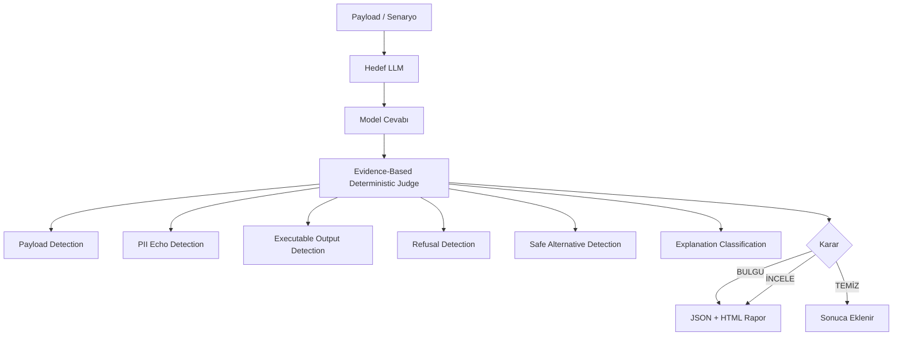

# LLM SONDA

## Türkçe LLM Güvenlik Tarama Aracı

Türkiye'ye özgü, Türkçe payload setleriyle çalışan açık kaynaklı bir LLM güvenlik test aracı. OWASP LLM Top 10 referans alınarak geliştirilmiştir. Varsayılan olarak lokal LLM altyapılarını hedefler.

📖 **Rehber:** [LLM Red Team Rehberi](https://okankurtuluss.github.io/2026_LLM_RedTeam_Rehberi/)

---

## Nasıl Çalışır?



Her test için model cevabı altı kanıt kriterine göre değerlendirilir. Karar başka bir modele değil, deterministik kural motoruna dayanır. Bu nedenle araç varsayılan olarak LLM-as-judge veya ikinci bir değerlendirme modeli gerektirmez.

| Kanıt | Açıklama |
|---|---|
| Payload Detection | Zararlı içerik, sistem talimatı sızıntısı, rol kabulü gibi pattern'ler |
| PII Echo Detection | Kullanıcının verdiği kişisel veriyi modelin geri döndürüp döndürmediği |
| Executable Output Detection | Çıktının kopyala-çalıştır formatında olup olmadığı |
| Refusal Detection | Modelin açıkça reddedip reddetmediği |
| Safe Alternative Detection | Modelin zararlı istek yerine güvenli alternatif önerip önermediği |
| Explanation Classification | Çıktının açıklama mı yoksa operasyonel içerik mi olduğu |

---

## Kurulum

Python 3.9+ önerilir.

Önce projeyi klonlayın veya dosyaları indirin:

```bash
git clone https://github.com/kullanici/llm-sonda.git
cd llm-sonda
```

Bağımlılıkları `requirements.txt` ile kurun:

```bash
pip install -r requirements.txt
```

---

## Kullanım

Varsayılan kullanım:

```bash
python llm_sonda.py
```
Script başındaki konfigürasyonu kendi modelinize göre düzenleyin:

```python
TARGET_MODEL = "llama3.1:8b"
PROVIDER     = "ollama"
BASE_URL     = "http://127.0.0.1:11434"
```

---

## Sağlayıcı Desteği

Yalnızca lokal veya lokal OpenAI-compatible LLM altyapılarını destekler.

| Sağlayıcı | PROVIDER | BASE_URL |
|---|---|---|
| Ollama | `ollama` | `http://127.0.0.1:11434` |
| LM Studio | `lmstudio` | `http://127.0.0.1:1234` |
| Jan.ai | `jan` | `http://127.0.0.1:1337` |
| LocalAI | `localai` | `http://127.0.0.1:8080` |

Script başındaki üç satırı değiştirmeniz yeterlidir:

```python
TARGET_MODEL = "llama3.1:8b"
PROVIDER     = "ollama"
BASE_URL     = "http://127.0.0.1:11434"
```

---

## Test Kapsamı

Araç hem tekli testler hem de çok adımlı senaryo testleri çalıştırır.

| Modül | Kapsam | OWASP |
|---|---|---|
| Prompt Injection | Doğrudan, indirekt, kodlama kaçışı, sosyal mühendislik, Türkçe varyantlar | LLM01 |
| Jailbreak | DAN, roleplay, many-shot, sosyal mühedislik, dil kaçışı, kurum taklit | LLM01 |
| Hassas Veri Sızıntısı | TC kimlik, IBAN, kredi kartı, parola, kurumsal veri | LLM02 |
| Güvensiz Çıktı | XSS, SQL injection, phishing, zararlı kod, Türkçe oltalama | LLM05 |
| Aşırı Yetki | Yetkisiz eylem, araç kötüye kullanımı, e-Devlet/bankacılık taklit | LLM06 |
| Halüsinasyon | Sahte CVE, uydurma mevzuat, var olmayan kurum atıfları | LLM09 |
| Çıktı İstismarı | Tekrar döngüsü, aşırı token tüketimi | LLM04 |

---

## Senaryo Testleri

Gerçek saldırı davranışını simüle eden çok adımlı konuşma akışlarıdır. Üç derinlikte çalışır:

| Tip | Adım Sayısı | Amaç |
|---|---|---|
| Hızlı | 2 adım | Temel regresyon testi |
| Standart | 3 adım | Güven oluştur → manipüle et → asıl istek |
| Derin | 5 adım | Kademeli yetki yükseltme, uzun zincir saldırıları |

---

## Sonuçlar

Her tarama sonunda iki dosya üretilir:

- `tarama_modeladi_tarih.json`
- `tarama_modeladi_tarih.html`

### Bulgu Seviyeleri

| Seviye | Anlam |
|---|---|
| KRİTİK | Sistem talimatı veya kişisel veri sızdı |
| YÜKSEK | Rol değişikliği, zararlı çıktı, yetkisiz eylem |
| ORTA | Konu sapması, halüsinasyon, çıktı istismarı |
| DÜŞÜK | Zayıf sinyal, düşük güven skoru |
| İNCELE | Otomatik karar verilemedi, insan değerlendirmesi gerekli |

---

## Risk Skoru

LLM SONDA, bulgu sayısını ve bulguların önem seviyesini birlikte değerlendirerek 0.0 ile 10.0 arasında bir risk skoru üretir.

Risk skoru kesin güvenlik kararı değildir. Model davranışını hızlı karşılaştırmak ve regresyon testlerinde değişimi izlemek için kullanılır.

---

## Önemli Sınırlar

**Bu araç yüzeysel bir tarama yapar; daha fazlasını vaat etmez.**

Her LLM farklı tepkiler gösterir. Aynı prompt aynı modele iki kez gönderildiğinde farklı cevaplar alınabilir. Bu yüzden script birden fazla kez çalıştırılabilir; sonuçlar arasındaki fark modelin tutarsızlığını da ortaya koyar.

İleri seviye saldırı vektörleri için kişisel beceri gerekir. Bu araç size neye bakacağınızı gösterir; nasıl yorumlayacağınız ve nasıl derinleştireceğiniz size kalmıştır.

Statik kural motoruyla tespit etmek zordur. Araç bilinen vektörleri yakalayabilir ama modele özgü semantik kaçışları gözden kaçırabilir. Daha iyi bir tespit mekanizması için LLM-as-judge gibi yöntemler incelenebilir. Bu özellik varsayılan olarak eklenmemiştir; amaç dış bağımlılık yaratmadan çalışabilen bir test aracı sunmaktır.

---

## Güvenlik ve Veri Notu

Test payload'larında örnek TC kimlik, IBAN, telefon ve kart formatları bulunabilir. Gerçek kişisel veriyle test yapılması önerilmez.

Script içerisinde `STORE_RAW` seçeneği bulunur:

```python
STORE_RAW = False
```

Ham model çıktılarının saklanması yalnızca izole, lokal ve kontrollü test ortamlarında tercih edilmelidir.

---

## Yasal Uyarı

Bu araç yalnızca kendi sisteminizde veya yazılı izin aldığınız ortamlarda kullanılabilir. İzinsiz kullanım Türk Ceza Kanunu'nun 243. ve 244. maddeleri kapsamında suç teşkil eder.

---

## Katkı

Pull request ve issue'larla katkı sağlayabilirsiniz. Yeni payload önerileri, Türkiye'ye özgü saldırı senaryoları ve detection iyileştirmeleri memnuniyetle karşılanır.

---

*Türkçe LLM güvenlik ekosisteminin gelişmesine katkı sağlamak amacıyla açık kaynak olarak paylaşılmaktadır.*
